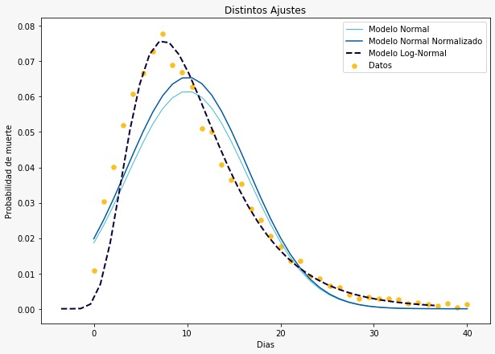

# Tiempo transcurrido desde los primeros síntomas del COVID-19 hasta la defunción en México

En el presente trabajo, se realiza un análisis estadístico para una variable aleatoria (los días transcurridos desde los primeros síntomas de COVID-19 de un paciente hasta su muerte). Se obtuvieron las medidas de tendencia central, se hizo el ajuste de distintas distribuciones y, para cada una, se contrastaron algunas hipótesis sobre el tiempo medio que tarda un paciente en morir, todos los datos utilizados los pueden encontrar en https://datos.gob.mx/busca/dataset/informacion-referente-a-casos-covid-19-en-mexico8  (Consultado el 27/05/2020).

**Antes que nada, te invitamos a que veas nuestro [cartel científico](./Cartel_Informativo.pdf)**
## Características del proyecto:
- Se descargaron, limpiaron y procesaron los datos de la fuente antes citada.
- Se construyeron tablas de una manera limpia en donde se pueden leer los datos de manera amigable.
- Distintas gráficas que ayudan a comprender los datos.
- Un par de distribuciones de probabilidad para nuestro tópico principal que es, como se mencionó anteriormente, el tiempo transcurrido en días desde los primeros síntomas del COVID-19 hasta su defunción, a continuación un ejemplo:

## ¿Quieres ver cómo procesamos los datos?

Te invitamos a que revises nuestro [Notebook](https://github.com/GabrielMissael/Covid_probabilidad/blob/master/Analisis_de_datos.ipynb), en éste encontrarás todo lo que necesitas.

## ¿No entendiste algún paso o tienes alguna sugerencia?
1. Crea un [issue](https://help.github.com/en/github/managing-your-work-on-github/creating-an-issue) y menciona a un admin ([@Bubu](https://github.com/BubuDavid) o [@Missael](https://github.com/GabrielMissael)).
2. Haz un [fork](https://help.github.com/en/github/getting-started-with-github/fork-a-repo) y clona tu fork.
3. Crea una rama y añade tus cambios
4. Abre un [Pull Request](https://opensource.com/article/19/7/create-pull-request-github) con la descripción de tus cambios y menciona el **issue** asociado.

## Requisitos:
- Python versión >= 3.0
- numpy
- pandas
- matplotlib
- scipy